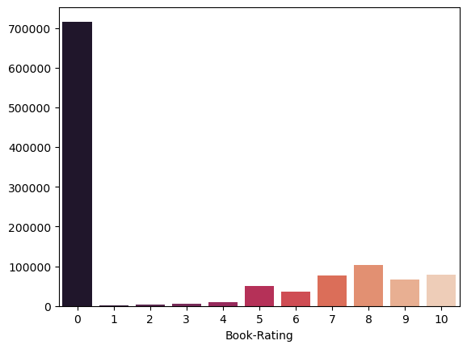
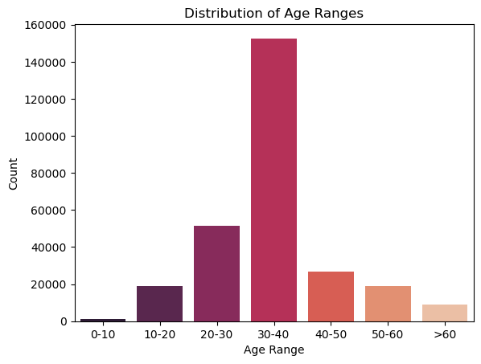
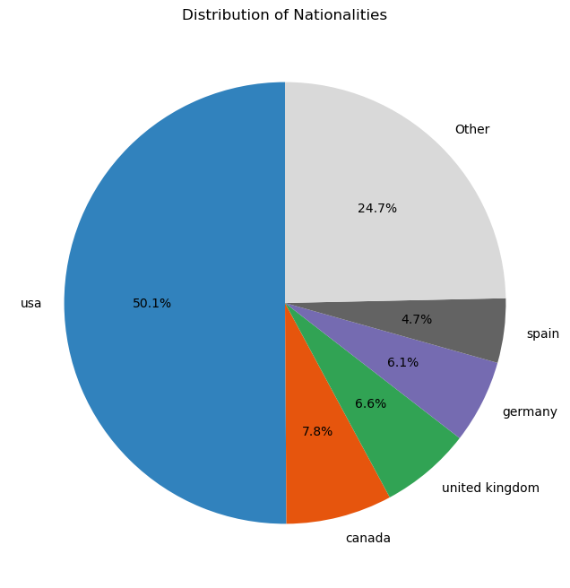

# Laporan Proyek Machine Learning Sistem Rekomendasi berbasis Collaborative Filtering - Rival Moh. Wahyudi

## Project Overview

Perpustakaan telah menjadi institusi penting dalam menyediakan akses terhadap informasi dan literatur selama berabad-abad. Sebagai pusat penyimpanan buku, manuskrip, dan sumber pengetahuan lainnya, perpustakaan memainkan peran kunci dalam mendukung pendidikan, penelitian, dan pengembangan budaya masyarakat. Namun, seiring berkembangnya teknologi, perpustakaan mengalami transformasi besar-besaran menuju era digital. Perpustakaan digital kini muncul sebagai solusi modern yang menawarkan akses lebih mudah, cepat, dan luas terhadap koleksi literatur, memungkinkan pengguna untuk membaca dan mengunduh buku tanpa harus datang secara fisik ke lokasi perpustakaan.

Meskipun perpustakaan digital membawa banyak manfaat, seperti efisiensi dan kemudahan akses, muncul tantangan baru yang harus diatasi. Salah satu tantangan terbesar adalah membantu pengguna menemukan buku yang sesuai dengan minat dan kebutuhan mereka di antara ribuan hingga jutaan koleksi yang tersedia. Tanpa sistem rekomendasi yang efektif, pengguna sering kali kesulitan mencari buku yang relevan, terutama jika mereka tidak memiliki preferensi atau informasi awal mengenai buku tertentu. Masalah ini dapat menyebabkan pengalaman pengguna yang kurang memuaskan dan potensi pemanfaatan perpustakaan digital yang kurang optimal.

Dalam konteks ini, sistem rekomendasi menjadi solusi yang sangat penting. Sistem rekomendasi dapat membantu perpustakaan digital untuk menyaring dan menyajikan koleksi buku yang relevan dan menarik bagi masing-masing pengguna (Paranjape, 2022). Dengan memanfaatkan data seperti riwayat pencarian, penilaian buku, atau preferensi pengguna, sistem ini mampu memberikan rekomendasi yang dipersonalisasi. Hal ini tidak hanya meningkatkan kepuasan pengguna dalam menemukan buku yang sesuai, tetapi juga memperluas cakrawala bacaan mereka dengan memperkenalkan buku-buku yang sebelumnya tidak mereka ketahui.

Selain itu, sistem rekomendasi juga dapat membantu perpustakaan digital meningkatkan efisiensi pengelolaan koleksi mereka (Kozulia, 2021). Dengan memahami pola preferensi pengguna, perpustakaan dapat mengoptimalkan penawaran koleksi dan strategi pengadaan buku berdasarkan tren atau kebutuhan yang paling diminati. Hal ini juga mendorong interaksi yang lebih intensif antara pengguna dan platform perpustakaan digital, menjadikan perpustakaan lebih relevan dan mendukung kebiasaan membaca di era digital.

Dengan demikian, penerapan sistem rekomendasi dalam perpustakaan digital bukan hanya sebagai alat tambahan, tetapi sebagai elemen krusial untuk meningkatkan pengalaman pengguna, mengoptimalkan pengelolaan koleksi, dan memperluas dampak positif perpustakaan dalam dunia digital yang terus berkembang.

Referensi:
- [Machine Learning and Collaborative Filtering-Based Book Recommendation System](https://ijircce.com/admin/main/storage/app/pdf/PGvDGdZFdjkp3ylkZCk13LZHuWyxYfKerGqGXDyC.pdf)
- [DETERMINE RECOMMENDATION SYSTEMS TO SEARCH FOR BOOKS BY PREFERENCES OF WEB USERS](https://www.semanticscholar.org/paper/DETERMINE-RECOMMENDATION-SYSTEMS-TO-SEARCH-FOR-BY-Kozulia-Sushko/333197d81bb5a83f782cf762ed2f5504c6179b3d?utm_source=consensus)

## Business Understanding

Perpustakaan digital telah menjadi alternatif modern dari perpustakaan konvensional dengan menawarkan kemudahan akses, koleksi yang luas, dan efisiensi dalam distribusi konten. Namun, dengan jumlah buku yang terus bertambah dalam koleksi digital, pengguna menghadapi tantangan besar dalam menemukan buku yang relevan dengan kebutuhan dan minat mereka. Masalah ini dapat dirinci sebagai berikut:

  1. Overload Informasi: Dengan jutaan buku yang tersedia, pengguna sering kali kesulitan menyaring informasi untuk menemukan buku yang sesuai. Ini membuat pengalaman pencarian menjadi kurang efisien dan membingungkan.

  2. Kurangnya Rekomendasi Personal: Tanpa adanya sistem rekomendasi, pengguna hanya bergantung pada kategori umum, pencarian manual, atau rekomendasi standar yang tidak mempertimbangkan preferensi individu. Akibatnya, banyak buku relevan yang tidak pernah ditemukan atau dibaca oleh pengguna.

  3. Minimnya Interaksi dan Kepuasan Pengguna: Pengguna yang tidak puas dengan hasil pencarian cenderung kurang termotivasi untuk kembali menggunakan layanan perpustakaan digital. Ini dapat mengurangi tingkat adopsi platform digital dan memperlambat pencapaian tujuan utama perpustakaan untuk menyebarkan pengetahuan.

Tanpa solusi yang tepat terhadap masalah ini, beberapa konsekuensi yang mungkin terjadi meliputi:

  1. Penurunan tingkat keterlibatan pengguna dengan perpustakaan digital.
  2. Potensi besar koleksi perpustakaan digital menjadi underutilized.
  3. Kurangnya nilai tambah bagi pengguna karena perpustakaan gagal menyediakan pengalaman pencarian yang optimal.

Sistem rekomendasi hadir sebagai jawaban atas tantangan ini. Dengan teknologi seperti machine learning dan data mining, sistem rekomendasi mampu:

  1. Meningkatkan Efisiensi Pencarian: Sistem ini dapat menyaring koleksi besar perpustakaan dan menyajikan rekomendasi yang relevan berdasarkan preferensi pengguna, riwayat bacaan, atau ulasan pengguna lain.

  2. Personalisasi Pengalaman Pengguna:Memberikan pengalaman unik kepada setiap pengguna dengan rekomendasi buku yang sesuai dengan minat, usia, atau kategori tertentu.

  3. Mendorong Keterlibatan dan Kepuasan Pengguna: Dengan menemukan buku yang relevan dengan lebih mudah, pengguna cenderung lebih puas dan terdorong untuk terus menggunakan layanan perpustakaan digital.

Bagian laporan ini mencakup:

### Problem Statements

Menjelaskan pernyataan masalah:
- Fitur apa yang digunakan untuk membuat sistem rekomendasi ini?
- Bagaimana hasil dari sistem rekomendasi ini?

### Goals

Menjelaskan tujuan proyek yang menjawab pernyataan masalah:
- Mengetahui fitur apa yang digunakan untuk membuat sistem rekomendasi ini
- Membuat sistem rekomendasi collaborative filtering yang dapat memberikan rekomendasi buku yang sesuai dengan preferensi dan minat pengguna

### Solution Statement
Dengan goal yang telah diatur diatas untuk dapat mencapai tujuan proyek dipakailah beberapa algoritma untuk membuat sistem rekomendasi collaborative filtering ini yaitu:
- Cosine Similarity
- SVD (Singular Value Decomposition)

dengan menggunakan kedua algoritma tersebut akan dicoba membangun sebuah sistem rekomendasi yang dapat memberikan rekomendasi buku yang sesuai dengan preferensi dan minat pengguna.

## Data Understanding

Data yang digunakan dalam proyek ini adalah data dari kaggle dengan judul "Book Recommendation Dataset". Dataset ini berisi 3 file, yaitu "books.csv", "ratings.csv", dan "users.csv"yang dapat digunakan untuk membuat sistem rekomendasi buku dari perpustakaan digital. detail dari setiap file tersebut adalah sebagai berikut:

1. books.csv: 271360 baris dan 8 kolom didalamnya dengan kolom sebagai berikut:
  - ISBN = Nomor dari setiap buku yang berstandar internasional
  - Book-Title = Judul buku
  - Book-Author = Penulis buku
  - Year-Of-Publication = Tahun terbit
  - Publisher = Penerbit
  - Image-URL-S = url gambar pertama
  - Image-URL-M = url gambar kedua
  - Image-URL-L = url gambar ketiga
2. ratings.csv: 1149780 baris dan 3 kolom didalamnya dengan kolom sebagai berikut:
  - User-ID = Nomor ID dari pengguna
  - ISBN = Nomor dari setiap buku yang berstandar internasional
  - Book-Rating = Rating buku
3. users.csv: 278858 baris dan 3 kolom didalamnya dengan kolom sebagai berikut:
  - User-ID = Nomor ID dari pengguna
  - Location = Lokasi
  - Age = Umur
  - Gender = Jenis kelamin

Untuk link dari dataset tersebut adalah sebagai berikut:
[Book Recommendation Dataset](https://www.kaggle.com/datasets/arashnic/book-recommendation-dataset)

Dalam tahapan ini diperiksa untuk setiap file yang ada yaitu melalui pengecekan kondisi data data tersebut dengan menggunakan beberapa metrik sebagai berikut:

1. books.csv:
  - Kolom data yang kosong:
    - Book-Author:2
    - Publisher:2
    - Image-URL-L:3
  - Jumlah data duplikat: 0
2. ratings.csv:
  pada file ini data yang dimiliki lengkap dan tidak ada data yang duplikat. hal ini menunjukkan data yang baik dengan persebaran rating data 1-10 dengan hasil visualisasi sebagai berikut:
  
  dari hasil diatas terlihat bahwa mayoritas data memiliki rating 0 dan hanya sebagian kecil yang memiliki rating lebih dari 0 yang memberikan sebuah kesimpulan bahwa data yang digunakan untuk membuat sistem rekomendasi buku ini hanya sebagian kecil data saja.
3. users.csv:
  pada file users.csv terdapat data yang hilang pada beberapa kolom seperti Age dengan jumlah data hilang sebanyak 110762. data yang hilang dari kolom tersebut akan diisi dengan dengan rata-rata umur pengguna. dari hal tersebut didapatkan visualiasasi sebagai berikut:
  
  terlihat dari viualisasi tersebut bahwa mayoritas umur pengguna adalah 30-40 tahun. dengan persebaran negara pengguna adalah sebagai berikut:
  
  terlihat bahwa mayoritas pengguna berasal dari negara Amerika Serikat/USA dan dengan 5 negara lainnya yaitu Canada, United Kingdom, Germany, dan Spain.

## Data Preparation

Pada bagian data preparation dalam projek ini dilakukan dalam beberapa tahapan, yaitu:
1. Menggabungkan data buku dan rating melalui kolom ISBN -> dilakukan penggabungan data buku dan rating ini guna untuk menyatukkan user dan buku apa saja yang dibaca oleh user tersebut dengan penggabungan data melalu kolom ISBN. penggabungan dilakukakn dengan menggunakan fungsi pd.merge dengan parameter on='ISBN'.

2. Mencari tahu berapa banyak sebuah buku dibaca melalui banyak jumlah rating yang diberikan oleh user -> proses ini dilakukan dengan menggunakan fungsi pd.value_counts untuk mengelompokkan data berdasarkan 'Book-Title' dan menghitung jumlah rating yang diberikan oleh user untuk setiap buku dengan fungsi 'count' dan hasil tersebut akan dalam kolom 'count'. hal ini bertujuan untuk mengetahui berapa kali buku dibaca oleh user.

3. Mencari tahu rata-rata rating sebuah buku melalui rata-rata rating yang diberikan oleh user -> proses ini dilakukan dengan menggunakan fungsi pd.groupby untuk mengelompokkan data berdasarkan 'Book-Title' dan menghitung rata-rata rating untuk setiap buku dengan fungsi 'mean'. hasilnya akan dalam kolom 'mean'. hal tersebut dilakukan untuk mengetahui rata-rata rating yang didapat untuk setiap buku.

4. Mengambil data buku dengan jumlah pembaca di atas 20 dan rata-rata rating di atas 4.5 -> setelah proses ke 3 dan 4 dilakukan akan menhasilkan data frame count dan mean. Dari dataframe tersebut akan digabungkan kembali dengan dataframe merge_df yang telah di gabungkan sebelumnya. karena tujuan awal adalah untuk mengetahui berapa banyak pembaca dari setiapa buku dan rata-rata rating dari setiap buku. kemudian akan di filter data yang jumlah pembaca di atas 20 dan rata-rata rating di atas 4.5 agar data yang kita gunakan data buku yang sudah pernah dibaca dan di rating oleh user untuk memudahkan data digunakan dalam algoritma rekomendasi nantinya. 

setelah pemilihan buku mana saja yang akan digunakan untuk membuat sistem rekomendasi ini, maka akan digunakan untuk memfilter dataset merge_df yang telah di gabungkan sebelumnya dengan ketentuan judul yang sudah diambil pada tahapan ke-4. dari seluruh proses tersebut dihasilkan data yang dapat digunakan untuk membuat sistem rekomendasi buku adalah sebanyak 21993 baris dan 8 kolom didalamnya dengan kolom sebagai berikut:
- ISBN = Nomor dari setiap buku yang berstandar internasional
- Book-Title = Judul buku
- Book-Author = Penulis buku
- Year-Of-Publication = Tahun terbit
- Publisher = Penerbit
- Image-URL-S = url gambar pertama
- Image-URL-M = url gambar kedua
- Image-URL-L = url gambar ketiga

Dari sekian banyak kolom yang dihasilkan,tetapi hanya bebrapa kolom saja yang akan digunakan untuk membuat sistem rekomendasi ini yaitu User-ID, Book-Tittle, dan Book-Rating. seluruh proses tersebut dilakukan agar data dapat diproses oleh algoritma cosine similarity nantinya.

## Modeling
Tahapan ini membahas mengenai model sisten rekomendasi yang Anda buat untuk menyelesaikan permasalahan. Sajikan top-N recommendation sebagai output.

Terdapat 2 algoritma yang saya gunakan dalam membuat sistem rekomendasi buku ini yaitu cosine similarity dan singular value decomposition (SVD), dengan setiap algoritma memiliki kelebihan dan kekurangannya dalam membuat sistem rekomendasi buku.

1. Cosine Similarity = algoritma ini bekerja dengan menghitung sudut antara 2 vektor yang berbeda, dalam projek ini maka yang digitung adalah kemiripan vektor dari rating yang diterima satu buku dengan buku lainnya dari setiap user. kemiripan vektor ini kemudian dijadikan sebagai input untuk membuat sistem rekomendasi buku ini. kelebihan dari algoritma ini adalah mudah dipahami dan diimplementasikan, tidak terpengaruh oleh skala rating, cocok untuk data sparse dimana data yang digunakan tidak banyak yang kosong atau memberikan rating 0, dan cocok untuk jumlah data dari kecil sampai sedang. namun, kekurangannya adalah kurang efektif untuk data yang ratingnya hanya di sebagian item saja atau sparse, sensitif terhadap outlier, dan dapat menjadi masalah jika data yang digunakan sangat besar.

hasil dari algoritma ini adalah sebagai berikut:

dari hasil diatas terlihat bahwa sistem dapat memberikan rekomendasi buku yang memiliki kemiripan dengan buku yang lainnya, dalam hasil tersebut juga ditampilkan angka kecocokan setiap hasil buku dengan buku yang di inputkan.

2. SVD = algoritma ini bekerja dengan memecah sebuah matrix menjadi 3 komponen yang lebih sederhana, kelebihan dari algoritma ini adalah membantu menyederhanakan dataset yang lebih besar menjadi dataset yang lebih kecil sambil mempertahankan informasi penting yang ada hal ini dapat membantu dalam menangkap hubungan tersembunyi antar data khususnya pada data user dan buku, cocok untuk dataset yang berukuran besar dan dapat menghasilkan hasil akurasi yang tinggi. kekurangan dari algoritma ini adalah kompleksitas yang tinggi, tidak dapat menangani cold start untuk user baru, dan sensitif terhadap parameter.

hasil dari algoritma ini adalah sebagai berikut:
 

hasil diatas menggunakan algoritma svd yang dimana parameter yang digunakan masih default atau bawaan dan belum diubah sama sekali. hasil tersebut menunjukkan rekomendasi yang didapatkan dengan memberikan informasi User-ID yang selanjutnya rekomendasi tersebut keluar dengan nama buku dan prediksi dari ratingnya.

cara untuk Mendapatkan sebuah hasil rekomendasi buku dari kedua sistem buku tersebut agak berbeda dimana satu algoritma menggunakan judul dari buku untuk mendapatkan sebuah rekomendasi dan algoritma lainnya menggunakan User-ID untuk mendapatkan sebuah rekomendasi. algoritma Cosine Similarity dalam projek ini memiliki kekurangan dimana data yang digunakan hanya sebagian sekcil dari data yang ada yang mungkin kurang efektif untuk data yang sangat besar. yang mana hal ini diatasi dalam algoritma SVD untuk memproses seluruh data yang ada.

## Evaluation

Metrik yang digunakan dalam projek ini adalah RMSE (Root Mean Squared Error). Metrik ini mengukur dengan cara mengakar kuadratkan hasil dari MSE memberikan interpretasi error dalam satuan yang sama dengan nilai aktual jadi kita dapat dengan mudah membandingkan error dengan satuan yang sama dengan data target.RMSE ini digunakan sebagai metrik evaluasi karena dapat memberikan nilai yang lebih akurat dan dapat memberikan gambaran tentang kesalahan yang terjadi dalam sistem rekomendasi buku. RMSE ini juga dapat memberikan gambaran tentang kesesuaian antara sistem rekomendasi buku dengan data yang sebenarnya. Rumus dari RMSE adalah sebagai berikut:

$$RMSE = \sqrt{\frac{1}{n}\sum_{i=1}^n(y_i - \hat{y_i})^2}$$

hasil dari pengukuran dari Metrik tersebut adalah sebagai berikut:
- RMSE model cosine similarity = 6.6217
- RMSE model SVD = 3.5159

dari hasil diatas dapat disimpulkan bahwa model SVD memiliki RMSE yang lebih kecil yang menunjukkan bahwa model SVD lebih akurat dalam memprediksi rating buku yang sesuai dengan rating yang sebenarnya dibandingkan dengan model cosine similarity.